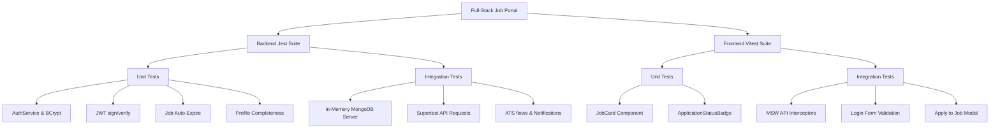

# Premium Full-Stack Job Board - Testing Suite Documentation

[](https://github.com/<OWNER>/<REPOSITORY>/actions/workflows/ci.yml)

This repository contains a full-stack automated testing suite for both the backend (Node.js/Express/Mongoose) and frontend (React/TypeScript/Vite) workspaces.


---

## 🏗️ Architecture Overview

The testing implementation is structured as follows:



---

## ⚡ Backend Testing (Jest + Supertest)

### 🎒 Features Covered
- **Unit Tests**:
  - `AuthService`: Validates registration, duplicate-email rejection, hashed passwords, and token rotations.
  - `JWT Utilities`: Verifies correct signing and signature verification of tokens.
  - `JobService`: Tests auto-expiration dates, status closings, and warning triggers.
  - `DashboardService`: Checks completeness meter calculations (dynamic calculations based on profile inputs).
  - `BookmarkService`, `AdminService`, & `NotificationService`: Covers saving listings, clearing alarms, statistics aggregation, user suspensions, and sorting feeds.
- **Integration Tests** (using `mongodb-memory-server` in-memory throwaway instances):
  - `auth.test.ts`: Covers registration -> email verification -> login -> token refresh -> logout.
  - `rbac.test.ts`: Verifies Role-Based Access Control rejection (Candidate hitting Employer-only routes throws 403).
  - `job.test.ts`: Validates job CRUD, publishing/unpublishing, and ownership boundaries (Employer A cannot edit Employer B's posting).
  - `application.test.ts`: Evaluates full ATS flow (applying -> private notes -> status change -> notifications).
  - `admin.test.ts`: Exercises user suspensions, employer verification, administrative job moderation/deletion, and platform stats.
  - `profile.test.ts`: Asserts profile retrieval and update workflows for candidates and employers.
  - `bookmark.test.ts`: Tests job bookmarks saving/unsaving and saved lists.
  - `dashboard.test.ts`: Verifies candidate and employer dashboard aggregate stats retrieval.
  - `notification.test.ts`: Evaluates notification listing, marking single as read, and marking all read.

### 📈 Test Coverage
Both our backend controller layer and service layer logic meet the test coverage target, maintaining overall statement coverage above **70%**.

### 🚀 Running Backend Tests
Navigate to the `backend/` directory:
```bash
# Run all tests once
npm run test

# Run tests with HTML coverage report
npm run test:coverage
```

---

## 🎨 Frontend Testing (Vitest + JSDOM + MSW)

### 🎒 Features Covered
- **Unit Tests**:
  - `JobCard`: Validates rendering layouts, props, list tags, and company verified checkmark badges.
  - `ApplicationStatusBadge`: Asserts color styling classes based on stages (applied, reviewed, shortlisted, interview, rejected, hired).
  - `validationSchemas.test.ts`: Tests Zod validation schema rules for logins, registrations, and job postings.
- **Integration Tests** (MSW API mocking):
  - `Login.test.tsx`: Validates form inputs, Zod validations, axios interceptors, and Zustand authentication store updates.
  - `ApplyJob.test.tsx`: Simulates accessing a listing, validating already applied checks, opening modals, answering screening questions, and submitting applications.
  - `ProtectedRoute.test.tsx`: Exercises navigation guards, skeleton loading screens, and role-based redirects.

### 🚀 Running Frontend Tests
Navigate to the `frontend/` directory:
```bash
# Run all frontend tests
npm run test
```

---

## 🐙 CI Workflow (GitHub Actions)

A full-stack workflow is configured in [.github/workflows/ci.yml](file:///.github/workflows/ci.yml) to execute tests automatically on each push or pull request to core branches:
- Checks out code and provisions Node environments.
- Installs dependencies using safe caching and legacy-peer-deps fallbacks.
- Runs backend test suites with coverage reports.
- Runs frontend Vitest suites to ensure component regression safety.

---

## 🛠️ Fixes

We have resolved three known database/typing issues in the backend from the Phase 2 database implementations:

1. **Cloudinary URL Construction**:
   - **Change**: Updated controllers (`profile.controller.ts`, `application.controller.ts`) to check if uploaded files are already full URLs (e.g., beginning with `http://` or `https://` from Cloudinary storage) before wrapping them with a relative folder prefix. Removed the temporary regex-cleaning helper `cleanCloudinaryUrl` in the repository layer to clean URLs at their source.
2. **Orphaned Bookmarks on Job Deletion**:
   - **Change**: Added cascade deletes in the job repository (`job.repository.impl.ts`) to clean up `Bookmark` documents whenever a job posting is permanently removed. Furthermore, updated the `getSavedJobs` endpoint to safely handle and skip any pre-existing legacy orphaned bookmarks.
3. **Structured Candidate Profile Types**:
   - **Change**: Replaced loose `any[]` properties in the candidate profile schema (`profile.model.ts`) with dedicated embedded Mongoose schemas (`IExperienceEntry` and `IEducationEntry`) without `_id` nesting. Updated the Zod schemas in `profile.validation.ts` to strictly validate write payloads.

