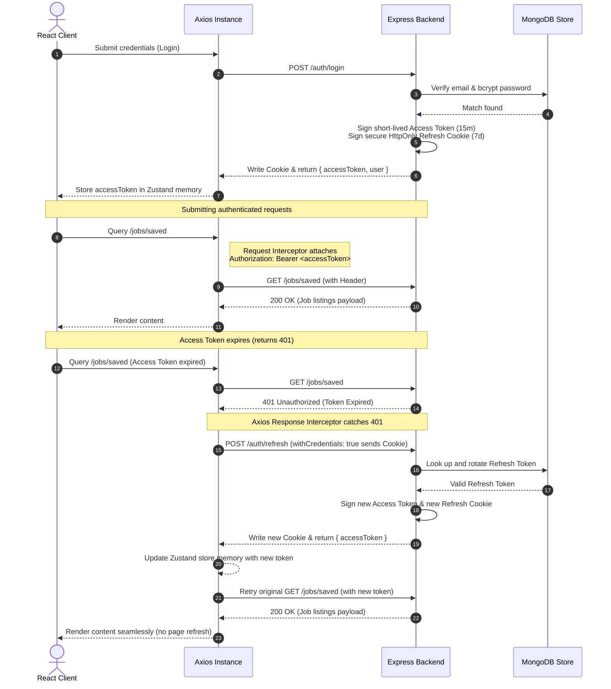

# Job Board Frontend client

This is the high-fidelity frontend client for the Job Board SaaS application. It is built using React (Vite), TypeScript, Tailwind CSS, Zustand, React Router, TanStack Query, React Hook Form, and Zod.

---

## Technical Stack
- **Build System**: React + TypeScript scaffolded via Vite
- **Styling**: Tailwind CSS with customized color system matching the premium theme rules
- **Routing**: React Router DOM (v6) with declarative role-based protected filters
- **State Management**: Zustand for global auth session tracking, custom stores for toast alerts
- **Form Management**: React Hook Form with Zod schema verification & backend error mapping
- **Data Caching**: TanStack Query (React Query) with optimistic UI mutations
- **HTTP Client**: Axios with dynamic request credentials and automatic JWT token refresh interceptors

---

## Getting Started

### 1. Prerequisite
Ensure the Phase 1–2 **Backend** service is running separately on port `5000` (e.g. `http://localhost:5000`). Make sure the database is seeded (`npx tsx src/seed.ts` in the `backend` folder) to establish test credentials.

### 2. Installation
Navigate into the `frontend` folder and install dependencies:
```bash
cd frontend
npm install
```

### 3. Environment Setup
Create a `.env` file in the `frontend` root folder (a template is preconfigured):
```env
VITE_API_URL=http://localhost:5000/api/v1
```

### 4. Running in Development
Start the client dev server:
```bash
npm run dev
```
The client will run on port `5173` (e.g. `http://localhost:5173`). Open the browser to start testing.

### 5. Compiling for Production
Ensure there are no TypeScript or compilation warnings:
```bash
npm run build
```

---

## Walkthrough: JWT Authentication & Token Flow

This application features a production-grade secure JWT flow that leverages **short-lived Access Tokens** stored in memory and **long-lived HttpOnly secure Refresh Cookies** stored by the browser.



### Detailed Token Flow Steps:

1. **Authentication Check on Boot (`checkAuth`):**
   - On app startup, the frontend performs a `POST /auth/refresh` request.
   - If a valid HttpOnly `refreshToken` cookie is present on the browser, the server validates it, issues a new `accessToken`, writes a rotated `refreshToken` cookie, and returns the access token.
   - The client then calls `GET /auth/me` with the new token to recover the active user details and stores it in the Zustand state (`user` and `accessToken`).
   - If the refresh token is missing or expired, the boot sequence completes and the guest routes are shown.

2. **Access Token Injection (Request Interceptor):**
   - Every outbound request sent via our custom `api` Axios client is caught by an interceptor.
   - It retrieves the current `accessToken` from the Zustand store.
   - If the token exists, it appends it to the `Authorization` header as a `Bearer` token.

3. **Automatic Token Refresh (Response Interceptor):**
   - If a request fails with a `401 Unauthorized` status (due to token expiry), the response interceptor catches it.
   - If a token refresh process is not already in progress, the interceptor sets a lock (`isRefreshing = true`) and triggers `POST /auth/refresh` with `withCredentials: true`.
   - If other requests fail with a `401` while the refresh is ongoing, they are queued in `failedRequestsQueue`.
   - **Rotation Success**: The refresh returns a new `accessToken`, which updates the Zustand store. The queued requests and the original failed request are then retried with the new token.
   - **Rotation Failure**: If the refresh token is invalid or has expired, the interceptor clears the Zustand store (setting `user = null` and `accessToken = null`), triggers a logout clean-up, and redirects the user to `/login`.
